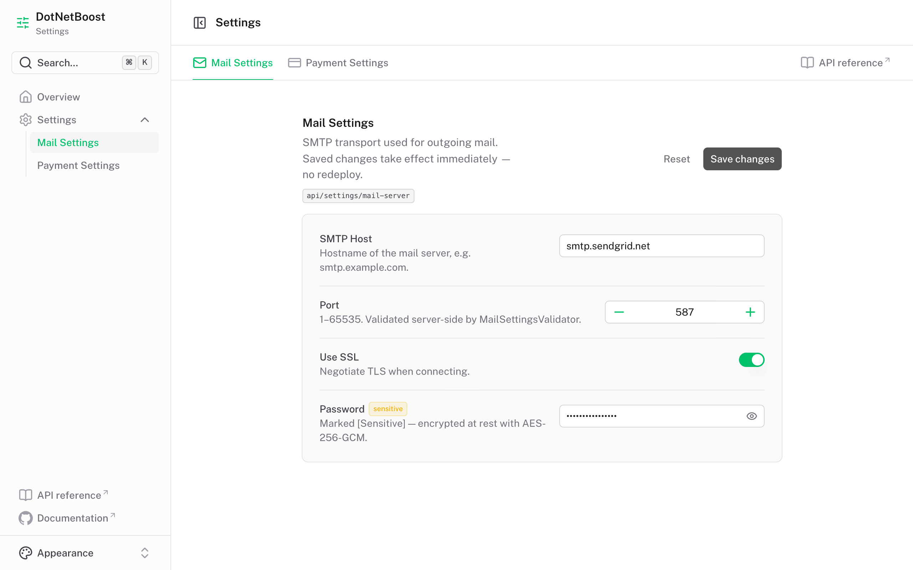
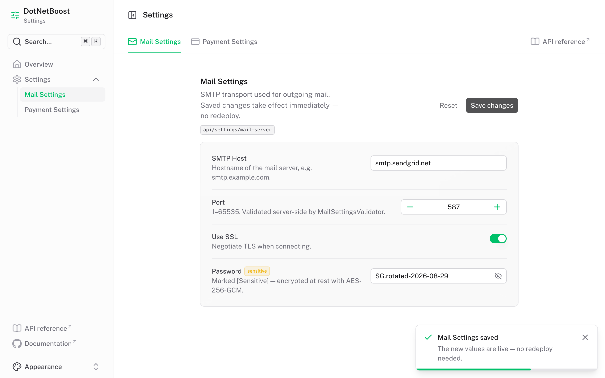
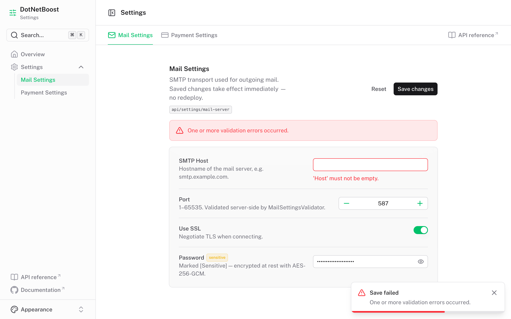

# DotNetBoost.Settings

[](https://github.com/dotnetboost/settings/actions/workflows/ci.yml)
[](https://www.nuget.org/packages/DotNetBoost.Settings.Core)
[](https://dotnet.microsoft.com/)
[](LICENSE)

A strongly-typed, database-backed **runtime settings manager** for .NET 8 and .NET 10. Store application settings in a database instead of `appsettings.json` so they can be **read and changed at runtime without redeployment** — with caching, encryption, audit trail, change notifications, validation, and auto-generated REST endpoints.

---

## Table of Contents

- [Why?](#why)
- [Packages](#packages)
- [Quick Start](#quick-start)
- [Defining Settings](#defining-settings)
- [Group names](#group-names)
- [Registering Services](#registering-services)
- [Reading & Writing Settings](#reading--writing-settings)
- [Concurrent writes](#concurrent-writes)
- [Caching](#caching)
- [Encryption for Sensitive Values](#encryption-for-sensitive-values)
- [Change Notifications](#change-notifications)
- [Audit Trail](#audit-trail)
- [Validation](#validation)
- [REST API Endpoints](#rest-api-endpoints)
- [Dashboard (SPA client)](#dashboard-spa-client)
- [Running everything with .NET Aspire](#running-everything-with-net-aspire)
- [Default Values](#default-values)
- [Architecture](#architecture)
- [Repository Layout](#repository-layout)
- [Configuration Reference](#configuration-reference)
- [Testing](#testing)
- [Contributing](#contributing)

---

## Why?

`appsettings.json` is static — changing it requires a redeploy or restart. `DotNetBoost.Settings` persists settings in a database instead:

| Feature | appsettings.json | DotNetBoost.Settings |
|---|---|---|
| Strongly-typed POCO | ✅ (Options pattern) | ✅ |
| Change at runtime, no redeploy | ❌ | ✅ |
| Multiple database backends | ❌ | ✅ EF Core / Dapper / MongoDB |
| Built-in REST API | ❌ | ✅ |
| Validation on write | Limited | ✅ enforced on every write path |
| Automatic caching | ❌ | ✅ with stampede protection |
| Encryption for secrets | ❌ | ✅ `[Sensitive]` + AES-256-GCM |
| Change history / audit | ❌ | ✅ pluggable `ISettingAuditStore` |
| Runtime change notifications | ❌ | ✅ `ISettingChangedHandler<T>` |

---

## Packages

| Package | Description |
|---|---|
| `DotNetBoost.Settings.Core` | Core engine — `ISettingManager`, caching, encryption, audit, change notifications |
| `DotNetBoost.Settings.EntityFrameworkCore` | EF Core provider (SQL Server, PostgreSQL, SQLite) + audit store |
| `DotNetBoost.Settings.Dapper` | Dapper provider (SQL Server, PostgreSQL, SQLite) |
| `DotNetBoost.Settings.MongoDb` | MongoDB provider |
| `DotNetBoost.Settings.FluentValidation` | FluentValidation integration |
| `DotNetBoost.Settings.API` | Auto-generated REST endpoints |

All packages multi-target **`net8.0`** (LTS) and **`net10.0`**.

On `net8.0` the EF Core provider resolves the EF Core 8.x family; on `net10.0` it resolves 10.x. Nothing in your application has to change either way.

```bash
dotnet add package DotNetBoost.Settings.Core
dotnet add package DotNetBoost.Settings.EntityFrameworkCore   # or Dapper / MongoDb
```

---

## Quick Start

```csharp
// 1. Define your settings
[SettingGroup("mail-server")]
public class MailSettings
{
    public string Host   { get; set; } = "smtp.example.com";
    public int    Port   { get; set; } = 587;
    public bool   UseSsl { get; set; } = true;
}

// 2. Register
builder.Services.AddSettings()
    .UseEntityFrameworkCore<AppDbContext>()
    .Build();

// 3. Use
app.MapGet("/test", async (ISettingManager settings) =>
{
    var mail = await settings.For<MailSettings>().GetAsync();
    return $"SMTP host: {mail.Host}:{mail.Port}";
});
```

A fully working example with encryption, validation, audit, and change notifications lives in [`samples/SampleApp`](samples/SampleApp).

---

## Defining Settings

```csharp
[SettingGroup("payment", Name = "PaymentSettings")]
public class PaymentSettings
{
    public string  GatewayUrl  { get; set; } = "https://gateway.example.com";

    [Sensitive]                          // encrypted at rest
    public string  ApiKey      { get; set; } = string.Empty;

    [SettingDefault(10_000)]             // used when no row exists yet
    public decimal MaxAmount   { get; set; } = 10_000m;

    public bool    SandboxMode { get; set; } = true;
}
```

**Rules:**
- Group name must be unique application-wide (see [Group names](#group-names) below).
- `[SettingGroup]` route value must be unique and non-empty.
- Violations throw `InvalidOperationException` at `Build()` time — fail fast at startup, not at 2am in production.

---

## Group names

`[SettingGroup]` carries two independent identifiers, and it is worth knowing which is which:

| | What it controls | Safe to change? |
|---|---|---|
| `route` (positional) | The URL segment: `/api/settings/{route}` | Yes — it is a URL, no stored data depends on it |
| `Name` | The **storage key** every row for this group is written under | No — changing it strands the existing rows |

`Name` is optional and **defaults to the class name**, which is the historical behaviour. Adding the attribute or upgrading the package never moves existing data.

Setting it explicitly is recommended, because without it your database schema is silently coupled to a C# identifier:

```csharp
[SettingGroup("mail-server", Name = "MailSettings")]
public class MailSettings { /* ... */ }
```

With `Name` pinned, the class can be renamed, moved to another namespace, or reorganised freely and it keeps reading the same rows. Without it, a rename that looks like pure refactoring silently orphans every stored value and the application quietly comes back up on defaults — including default credentials.

### Migrating an existing group

Adding `Name` to a class that **already has rows** requires renaming those rows, because you are changing the key they are stored under. Do it in the same deploy as the code change:

```sql
UPDATE Settings     SET SettingGroup = 'new-name' WHERE SettingGroup = 'OldClassName';
UPDATE SettingAudits SET SettingGroup = 'new-name' WHERE SettingGroup = 'OldClassName';
```

```js
// MongoDB
db.settings.updateMany({ Group: "OldClassName" }, { $set: { Group: "new-name" } })
```

If you set `Name` to exactly the current class name — as the samples above do — there is nothing to migrate, and you gain the freedom to rename the class later.

Two groups resolving to the same name would read and write each other's rows, so `Build()` rejects it at startup. That check compares resolved names, which means two same-named classes in different namespaces still collide unless one of them sets a distinct `Name`.

---

## Concurrent writes

`SetAsync` writes **only the properties whose values differ from what is stored**, and each of
those writes is conditional on an optimistic concurrency token (`Setting.RowVersion`). Every
provider enforces it: SQL Server, PostgreSQL, SQLite and MongoDB. A write whose token no longer
matches throws `SettingConcurrencyException` rather than silently overwriting.

```csharp
try
{
    await settings.For<MailSettings>().SetAsync(model);
}
catch (SettingConcurrencyException ex)
{
    // ex.Group / ex.Key name the property that moved. Re-read, re-apply, retry.
}
```

### Across a read-edit-write cycle

Per-row tokens cannot, on their own, protect an edit made *by your application* — a settings
POCO carries no record of the revision it was loaded at, so a stale copy of a field is
indistinguishable from a deliberate edit. The revision therefore has to travel out to the
caller and back.

Over HTTP that is an entity tag, and the generated endpoints do it for you:

```http
GET /api/settings/mail-server
200 OK
ETag: "9f2c1a7b3e5d0148"

POST /api/settings/mail-server
If-Match: "9f2c1a7b3e5d0148"
→ 204 No Content     if the group is still at that revision
→ 412 Precondition Failed   if someone saved in between
```

A POST without `If-Match` writes unconditionally, so existing clients keep working. Once every
client round-trips the tag, make it mandatory — a POST without the header is then rejected with
`428 Precondition Required`:

```csharp
app.MapSettingsEndpoints(requireIfMatch: true);
```

Programmatic callers get the same thing through the accessor:

```csharp
var version = await settings.For<MailSettings>().GetVersionAsync();
var model   = await settings.For<MailSettings>().GetAsync();
model.Host  = "smtp.new.example.com";
await settings.For<MailSettings>().SetAsync(model, version);   // throws if the group moved
```

> The check runs against the same snapshot the writes are built from, and the per-row tokens
> still guard the individual UPDATEs — so there is no window between checking the version and
> applying the change.

The bundled dashboard does this already: it keeps the `ETag` from the load and sends it on
save. When the API refuses with `412` it does **not** discard your edits — it shows what
happened and offers two ways out:

- **Re-apply my changes** — re-reads the group, keeps the other writer's edits to fields you did
  not touch, replays only your own on top, and saves against the fresh revision.
- **Discard mine and reload** — throws your edits away and starts from the current values.

Because the SPA reaches the API through its own Nitro proxy, the `ETag` is same-origin and
readable from JavaScript without `Access-Control-Expose-Headers`.

---

## Registering Services

### Entity Framework Core

```csharp
public class AppDbContext(DbContextOptions<AppDbContext> options)
    : DbContext(options), ISettingDbContext
{
    public DbSet<Setting>           Settings      => Set<Setting>();
    public DbSet<SettingAuditEntry> SettingAudits => Set<SettingAuditEntry>();

    protected override void OnModelCreating(ModelBuilder mb)
        => mb.ApplySettingsConfiguration(DatabaseProvider.Sqlite);
        // Options: SqlServer | PostgreSql | Sqlite
}
```

```csharp
builder.Services.AddDbContext<AppDbContext>(o => o.UseSqlite("Data Source=app.db"));
builder.Services.AddSettings()
    .UseEntityFrameworkCore<AppDbContext>()
    .Build();
```

Run `dotnet ef migrations add Init && dotnet ef database update` — this creates both the `Settings` and `SettingAudits` tables.

### Dapper

```csharp
builder.Services.AddSettings()
    .UseDapper(sp => new SqlConnection(connectionString), migrateSchema: true)
    .Build();
```

Supports `SqlConnection`, `NpgsqlConnection`, and `SqliteConnection`. `migrateSchema: true` auto-creates `Settings` and `SettingAudits` tables on startup.

### MongoDB

```csharp
builder.Services.AddSettings()
    .UseMongoDb("mongodb://localhost:27017", "my_app_db")
    .Build();
```

The unique `(Group, Key)` index the store relies on is created once at startup by a hosted service. Pass `createIndexes: false` if the application's MongoDB user has no index-creation rights or you manage the index out of band — the store still assumes it exists.

**If your application already has a MongoDB client** — through .NET Aspire, or its own registration — pass a factory instead, so the settings store shares it rather than opening a second one:

```csharp
builder.AddMongoDBClient("settingsdb");          // Aspire, or your own AddSingleton<IMongoClient>

builder.Services.AddSettings()
    .UseMongoDb(sp => sp.GetRequiredService<IMongoClient>().GetDatabase("my_app_db"))
    .Build();
```

Either overload keeps `IMongoClient` and `IMongoDatabase` out of the container: the provider holds its database privately, so it can neither override nor be overridden by your application's own Mongo registration — whichever order they happen in.

---

## Reading & Writing Settings

```csharp
public class EmailService(ISettingManager settings)
{
    public async Task<SmtpClient> CreateClientAsync()
    {
        var mail = await settings.For<MailSettings>().GetAsync();
        return new SmtpClient(mail.Host, mail.Port) { EnableSsl = mail.UseSsl };
    }

    public async Task<int> GetPortAsync()
        => await settings.For<MailSettings>().GetAsync(x => x.Port);

    public async Task UpdatePortAsync(int port)
        => await settings.For<MailSettings>().SetAsync(x => x.Port, port);

    public async Task<bool> IsConfiguredAsync()
        => await settings.For<MailSettings>().ExistsAsync(allProperties: true);
}
```

| Method | Description |
|---|---|
| `GetAsync(refreshCache, ct)` | Returns the full settings object |
| `GetAsync(selector, refreshCache, ct)` | Returns one property |
| `SetAsync(model, ct)` | Persists the full object — validates, encrypts, audits, notifies |
| `SetAsync(selector, value, ct)` | Updates a single property |
| `ExistsAsync(allProperties, ct)` | Checks row existence |
| `ClearAsync(ct)` | Deletes all settings for the group |
| `GetVersionAsync(ct)` | Current revision, for conditional writes |
| `SetAsync(model, expectedVersion, ct)` | Persists only if the group is still at that revision |

> **There is no synchronous read.** A blocking `Get()` would park a thread-pool thread on
> database I/O, and under load that starves the pool for the whole application — not just for
> settings. Where a value is needed inside a synchronous lambda, read it once with `await`
> beforehand and capture it; that is both correct and cheaper than resolving it per element.

---

## Caching

Reads go through `ISettingCache` (default: `IMemoryCache`, 10-minute absolute expiration). A per-group `SemaphoreSlim` prevents cache stampedes under concurrent load.

```csharp
builder.Services.AddSettings()
    .UseEntityFrameworkCore<AppDbContext>()
    .WithCacheDuration(TimeSpan.FromMinutes(5))
    .UseCustomCache<RedisSettingCache>()   // swap in a distributed cache
    .Build();
```

> **Multi-node note:** the default cache is per-instance in-memory. In a multi-node deployment, use `UseCustomCache<T>()` with a distributed cache (Redis, etc.) so a write on one node invalidates the cache on all nodes.

```csharp
public class RedisSettingCache(IConnectionMultiplexer redis) : ISettingCache
{
    private readonly IDatabase _db = redis.GetDatabase();

    public bool TryGetValue<T>(string key, out T? value)
    {
        var raw = _db.StringGet(key);
        if (!raw.HasValue) { value = default; return false; }
        value = JsonSerializer.Deserialize<T>(raw!);
        return value is not null;
    }

    public void Set<T>(string key, T value, TimeSpan duration)
        => _db.StringSet(key, JsonSerializer.Serialize(value), duration);

    public void Remove(string key) => _db.KeyDelete(key);
}
```

---

## Encryption for Sensitive Values

Mark any property `[Sensitive]` and it is transparently encrypted before storage and decrypted on read — API keys, passwords, connection strings never touch the database as plaintext.

This is encryption **at rest**. It protects a database dump, a backup, or anyone with table access. It is not an access control: your application reads these values decrypted, and so does the REST API if you expose it — see [Securing the endpoints](#securing-the-endpoints).

```csharp
[SettingGroup("mail-server")]
public class MailSettings
{
    public string Host { get; set; } = "smtp.example.com";

    [Sensitive]
    public string Password { get; set; } = string.Empty;
}
```

```csharp
// Built-in AES-256-GCM encryptor
var key = Convert.ToBase64String(RandomNumberGenerator.GetBytes(32)); // store this in a secret manager!

builder.Services.AddSettings()
    .UseEntityFrameworkCore<AppDbContext>()
    .UseAesEncryption(key)
    .Build();
```

Or plug in your own (Azure Key Vault, AWS KMS, etc.):

```csharp
public class KeyVaultEncryptor(SecretClient client) : ISettingEncryptor
{
    public string Encrypt(string plaintext) { /* ... */ }
    public string Decrypt(string ciphertext) { /* ... */ }
}

builder.Services.AddSettings()
    .UseCustomEncryption<KeyVaultEncryptor>()
    .Build();
```

> **Never hardcode the AES key.** Load it from an environment variable, Azure Key Vault, AWS Secrets Manager, or similar — the sample app generates a throwaway key at startup purely for demonstration.

### Rotating the encryption key

Each encrypted value is stored as `v1:{keyId}:{base64}`, where `keyId` is a short fingerprint of the key that wrote it. That is what makes rotation safe: a value can be traced back to its key instead of just failing to authenticate.

Pass the new key first and keep the old one as a retired key — retired keys decrypt, they never encrypt:

```csharp
builder.Services.AddSettings()
    .UseEntityFrameworkCore<AppDbContext>()
    .UseAesEncryption(newKey, oldKey)   // reads use either; writes use newKey
    .Build();
```

Deploy that, then rewrite each group once (any `SetAsync` will do — including a save from the dashboard or `POST /api/settings/{route}`). Every rewritten group is re-encrypted under the new key. Once all of them have been rewritten, drop `oldKey`:

```csharp
    .UseAesEncryption(newKey)
```

Values written before key ids existed are still readable: they carry no `v1:` prefix, so each configured key is tried in turn. AES-GCM authenticates, so a wrong key fails cleanly rather than returning garbage.

> **A value that cannot be decrypted throws `SettingDecryptionException`.** This is deliberate — the alternative is a settings model whose secrets silently hold their compile-time defaults, so a mishandled rotation would leave the application running on default credentials instead of failing. `IgnoreDecryptionFailures()` restores the fall-back-to-default behaviour if you genuinely want it.

---

## Change Notifications

React to settings changes at runtime — no restart needed to pick up a new SMTP host, feature flag, or rate limit.

```csharp
public class MailSettingsChangedHandler(ILogger<MailSettingsChangedHandler> logger)
    : ISettingChangedHandler<MailSettings>
{
    public Task OnChangedAsync(MailSettings previous, MailSettings current, CancellationToken ct = default)
    {
        logger.LogInformation("Mail host changed: {Old} -> {New}", previous.Host, current.Host);
        // Rebuild your SmtpClient pool, refresh a cached connection, etc.
        return Task.CompletedTask;
    }
}
```

```csharp
builder.Services.AddScoped<MailSettingsChangedHandler>();
builder.Services.AddSettings()
    .UseEntityFrameworkCore<AppDbContext>()
    .OnChanged<MailSettings, MailSettingsChangedHandler>()
    .Build();
```

Multiple handlers per settings type are supported and run in registration order. A handler that throws is logged and does not roll back the write or block other handlers.

---

## Audit Trail

When an audit store is registered, `SetAsync` records the before/after value, property key, and timestamp for **each property whose value actually changed**. Properties identical to what is already stored are not written to the trail, so saving a model with one edited field produces one entry rather than one per property.

```csharp
builder.Services.AddSettings()
    .UseEntityFrameworkCore<AppDbContext>()
    .UseAuditStore<EfCoreAuditStore>()      // ships with the EF Core package
    .Build();
```

Query history directly:

```csharp
IReadOnlyList<SettingAuditEntry> history =
    await auditStore.GetHistoryAsync("MailSettings", key: "Host");
```

Or via the REST API — every settings group automatically gets a `GET /api/settings/{route}/audit` endpoint. The audit store is optional: without one the endpoint returns `404` with an explanatory body, and the rest of the settings API is unaffected.

Values marked `[Sensitive]` are recorded as `[encrypted]` on both sides of the entry rather than in cleartext. Change detection compares them as plaintext, not as stored ciphertext: AES-GCM draws a fresh nonce on every call, so an unchanged secret is re-encrypted to different bytes each save and a ciphertext comparison would log a spurious change every time.

Write your own store (SQL table, Elasticsearch, whatever) by implementing `ISettingAuditStore`.

---

## Validation

Validation is now enforced on **every write path** — both `SetAsync()` calls from your code and `POST` requests to the REST API — not just the API as before.

### Data Annotations

```csharp
[SettingGroup("mail-server")]
public class MailSettings
{
    [Required, MaxLength(255)]
    public string Host { get; set; } = string.Empty;

    [Range(1, 65535)]
    public int Port { get; set; } = 587;
}
```

### FluentValidation

```csharp
public class MailSettingsValidator : AbstractValidator<MailSettings>
{
    public MailSettingsValidator()
    {
        RuleFor(x => x.Host).NotEmpty().MaximumLength(255);
        RuleFor(x => x.Port).InclusiveBetween(1, 65535);
    }
}
```

```csharp
builder.Services.AddSettings()
    .UseEntityFrameworkCore<AppDbContext>()
    .UseFluentValidation(Assembly.GetExecutingAssembly())
    .Build();
```

A failed `SetAsync()` throws `SettingValidationException` with an `Errors` dictionary. A failed `POST` returns HTTP `400` with `ValidationProblemDetails`.

---

## REST API Endpoints

```bash
dotnet add package DotNetBoost.Settings.API
```

```csharp
app.MapSettingsEndpoints();
```

Registers, per `[SettingGroup]` class:

| Method | Route | Description |
|---|---|---|
| `GET`  | `/api/settings/{route}` | Current values, with an `ETag` for the revision |
| `POST` | `/api/settings/{route}` | Validate + persist; honours `If-Match`, `412` on a lost race |
| `GET`  | `/api/settings/{route}/audit` | Change history (`404` if no audit store configured) |

### Securing the endpoints

**The generated endpoints are anonymous by default.** The library deliberately does not impose an
authorization policy — who may read and write your settings is your application's decision, not
this package's. It gives you the mechanism; you choose the policy.

Apply `[Authorize]` to the settings class and it covers all three endpoints for that group:

```csharp
[SettingGroup("payment", Name = "PaymentSettings")]
[Authorize(Roles = "Admin")]                    // or [Authorize(Policy = "SettingsAdmin")]
public class PaymentSettings
{
    [Sensitive]
    public string ApiKey { get; set; } = string.Empty;
}
```

> **Do this before exposing a group that holds `[Sensitive]` properties.**
> `GET` returns the settings object as your application sees it, which means secrets come back
> **decrypted** — that is what makes an editable admin UI possible. `[Sensitive]` encrypts values
> *at rest*: it protects a database dump, a backup, or a DBA with table access. It does not
> protect the API, which holds the key and decrypts on read. Without `[Authorize]`, a single
> unauthenticated `GET` returns every secret in the group in plaintext.

Standard ASP.NET Core authorization applies, so anything that works elsewhere works here —
roles, policies, schemes:

```csharp
[Authorize(AuthenticationSchemes = "Bearer", Policy = "SettingsAdmin")]
```

Remember that authorization is per class. Adding a new `[SettingGroup]` starts it anonymous, so
the attribute is worth adding at the same time as the class rather than afterwards.

> The [`samples/SampleApp`](samples/SampleApp) settings classes carry no `[Authorize]` on
> purpose — the sample is a showcase of the library's features and runs without an identity
> provider. Do not copy that part into a real application.

---

## Dashboard (SPA client)

[`clients/dashboard`](clients/dashboard) is a [Nuxt 4](https://nuxt.com) single-page client for
those endpoints, built on the [Nuxt UI dashboard template](https://github.com/nuxt-ui-templates/dashboard).
A sidebar links to **Settings**, where a top menu holds one entry per settings group — each one
reads and writes its own group.

```bash
dotnet run --project samples/SampleApp --urls http://localhost:5199   # the API
npm install --prefix clients/dashboard && npm run dev --prefix clients/dashboard
```

The dashboard is at `http://localhost:3000`, the API reference at `http://localhost:5199/scalar`.
Or start both — plus PostgreSQL and Redis — with one `dotnet run`; see
[Running everything with .NET Aspire](#running-everything-with-net-aspire).

### One group, end to end

`MailSettings` from [`samples/SampleApp`](samples/SampleApp) — the class, its `[Sensitive]`
property and its `MailSettingsValidator` — as the dashboard renders it:



The form is built from whatever `GET api/settings/mail-server` returned. `UseSsl` is a `bool`, so
it renders as a switch; `Password` is `[Sensitive]`, so it is masked behind a reveal toggle and the
value never touches the database unencrypted.



`Save changes` sends the whole group back with the `ETag` from the load as `If-Match`, so a save
that lost a race is refused rather than silently overwriting the other writer. The saved values are
live for the running application immediately.



Clear the host and the API rejects the write. Each `ValidationProblemDetails` message comes back
attached to the property it names — `RuleFor(x => x.Host).NotEmpty()` in `MailSettingsValidator`
lands under **SMTP Host**, with nothing written.

| File | Role |
|---|---|
| `app/utils/settings.ts` | Group registry — `route` must match `[SettingGroup("…")]` |
| `app/composables/useSettingsGroup.ts` | Load, dirty-tracking, save, server-error mapping |
| `app/components/settings/GroupForm.vue` | The form for one group |
| `app/pages/settings.vue` | Top menu, one entry per group |
| `server/api/settings/[...path].ts` | Nitro proxy to the .NET API |

Form fields are generated from whatever `GET` returns, so a property added to a C# settings class
shows up without touching the client — the registry only supplies labels and input constraints.
Booleans render as switches, `[Sensitive]` properties as masked inputs with a reveal toggle, and a
rejected `POST` has each `ValidationProblemDetails` message attached to the property it names.

The browser never calls the API directly: Nitro proxies `/api/settings/**` to
`NUXT_SETTINGS_API_URL`, so the API needs no CORS configuration. See
[`clients/dashboard/README.md`](clients/dashboard/README.md) for the full setup.

---

## Running everything with .NET Aspire

[`aspire/DotNetBoost.Settings.AppHost`](aspire/DotNetBoost.Settings.AppHost) orchestrates the whole
stack — API, dashboard and every backing service — from one command:

```bash
dotnet run --project aspire/DotNetBoost.Settings.AppHost
```

That needs nothing installed beyond the .NET 10 SDK and a running container engine (Docker or
Podman) — the AppHost pulls the orchestrator and dashboard from NuGet via `dnx aspire.cli` on first
run. Watch the console for the dashboard link; it carries a one-time login token.

The Aspire CLI is optional and shortens the command to `aspire run`. Install it whichever way suits
you — the first needs no elevation and no new tool chain:

```bash
dotnet tool install -g Aspire.Cli
```

```bash
brew install --cask microsoft/aspire/aspire
```

Also available as `npm install -g @microsoft/aspire-cli`, `winget install Microsoft.Aspire`, or the
script at [get.aspire.dev](https://get.aspire.dev). `aspire run` works from anywhere in the repo —
[`aspire.config.json`](aspire.config.json) points it at the AppHost.

What comes up:

| Resource | What it is |
|---|---|
| `postgres` / `settingsdb` | PostgreSQL 18 container, named volume, persistent across runs |
| `pgweb` | Browser SQL client for inspecting `Settings` and `SettingAudits` |
| `cache` | Redis container backing `RedisSettingCache` |
| `redisinsight` | Browser UI for watching the cache fill and expire |
| `api` | `samples/SampleApp` — the REST endpoints and the Scalar reference at `/scalar` |
| `dashboard-installer` | `npm install` for the Nuxt client, run once before the dev server |
| `dashboard` | `clients/dashboard` — `npm run dev`, wired to the API automatically |

The Aspire dashboard lists every resource with its URL, console output, environment, and the
OpenTelemetry traces, metrics and structured logs the API emits through
[`DotNetBoost.Settings.ServiceDefaults`](aspire/DotNetBoost.Settings.ServiceDefaults).

Nothing is configured by hand. The AppHost injects `ConnectionStrings__settingsdb` and
`ConnectionStrings__cache` into the API, and `NUXT_SETTINGS_API_URL` /
`NUXT_PUBLIC_API_REFERENCE_URL` into the dashboard, so the values in
`clients/dashboard/.env.example` are only needed when you run the two halves separately.

### Switching the storage provider

The AppHost starts PostgreSQL and the API talks to it through EF Core. Every other provider is
written out in full and commented, so switching is four edits and no new code:

| File | What to change |
|---|---|
| `aspire/…/AppHost.cs` | Comment the active provider block, uncomment another |
| `aspire/…/DotNetBoost.Settings.AppHost.csproj` | Uncomment that provider's `Aspire.Hosting.*` package |
| `samples/SampleApp/SampleApp.csproj` | Uncomment the matching `ItemGroup` |
| `samples/SampleApp/Program.cs` | Comment the active block, uncomment the matching one |

The available blocks are PostgreSQL (EF Core, active), SQL Server (EF Core), SQLite (EF Core, no
container), MongoDB, and Dapper on PostgreSQL. For the EF Core ones, also flip the
`DatabaseProvider` passed to `ApplySettingsConfiguration` in `samples/SampleApp/AppDbContext.cs` —
it decides the column type used for `Value` and how `RowVersion` is mapped.

### The Redis cache

`samples/SampleApp/Caching/RedisSettingCache.cs` is a real
[`ISettingCache`](src/DotNetBoost.Settings.Core/Interfaces/ISettingCache.cs) over Redis, registered
with `.UseCustomCache<RedisSettingCache>()`. It exists because the default `IMemoryCache` gives every
API instance its own copy: a write on one leaves the others serving stale values until their entry
expires. Redis makes the update visible fleet-wide at once. Drop the `AddRedisClient("cache")` and
`.UseCustomCache<…>()` lines in `Program.cs`, plus the `cache` resource in `AppHost.cs`, to fall back
to the in-memory cache.

### Secrets

The AES key protecting `[Sensitive]` properties comes from the `settings-encryption-key` parameter,
which the AppHost passes to the API as `Settings__EncryptionKey`. Its development value lives in
`aspire/DotNetBoost.Settings.AppHost/appsettings.json` — a throwaway key for local containers only.
Override it anywhere real:

```bash
dotnet user-secrets set Parameters:settings-encryption-key "$(openssl rand -base64 32)" --project aspire/DotNetBoost.Settings.AppHost
```

Rotating the key makes values already encrypted under the old one unreadable, so the persistent
Postgres volume and the key belong together.

## Default Values

```csharp
[SettingGroup("rate-limit")]
public class RateLimitSettings
{
    [SettingDefault(100)]
    public int RequestsPerMinute { get; set; }
}
```

If no row exists in the store yet, `RequestsPerMinute` returns `100` instead of the CLR default `0` — useful for rolling out a new setting without a migration that back-fills every existing environment.

---

## Architecture

```
┌──────────────────────────────────────────────────────────────────┐
│  Your Application                                                 │
│  ISettingManager.For<T>() → ISettingAccessor<T>                   │
└───────────────────────────┬────────────────────────────────────┘
                             │
                      SettingManager
        ┌───────────┬────────┼────────┬─────────────┐
        │           │        │        │             │
  ISettingCache  ISettingStore  ISettingEncryptor  ISettingAuditStore
  (IMemoryCache   (EF Core /      (AES-256-GCM       (EfCoreAuditStore
   or Redis)       Dapper /        or custom)          or custom)
                   MongoDB)
                             │
                   ISettingChangedHandler<T>
                   (your app's runtime reactions)
```

---

## Repository Layout

```
dotnetboost/
├── src/                                       # Library projects (each = 1 NuGet package)
│   ├── DotNetBoost.Settings.Core/
│   ├── DotNetBoost.Settings.EntityFrameworkCore/
│   ├── DotNetBoost.Settings.Dapper/
│   ├── DotNetBoost.Settings.MongoDb/
│   ├── DotNetBoost.Settings.FluentValidation/
│   └── DotNetBoost.Settings.API/
├── tests/
│   ├── DotNetBoost.Settings.UnitTests/         # Core logic, mocked stores
│   ├── DotNetBoost.Settings.ProviderTests/     # Store contract, in-process SQLite
│   ├── DotNetBoost.Settings.IntegrationTests/  # Same contract, real engines (needs Docker)
│   └── DotNetBoost.Settings.ApiTests/          # Minimal-API endpoints via TestHost
├── samples/
│   └── SampleApp/                              # Runnable end-to-end demo
├── clients/
│   └── dashboard/                              # Nuxt 4 settings dashboard (SPA client)
├── aspire/
│   ├── DotNetBoost.Settings.AppHost/           # Orchestrates API + dashboard + containers
│   └── DotNetBoost.Settings.ServiceDefaults/   # OTel, health checks, service discovery
├── docs/
├── .github/
│   ├── workflows/ci.yml
│   └── ISSUE_TEMPLATE/
├── Directory.Build.props                       # Shared MSBuild settings (net10.0, analyzers)
├── Directory.Packages.props                    # Central package version management
├── DotNetBoost.Settings.sln
├── aspire.config.json                          # Points `aspire run` at the AppHost
├── CHANGELOG.md
├── CONTRIBUTING.md
└── README.md
```

---

## Configuration Reference

### `AddSettings()` builder methods

| Method | Package | Description |
|---|---|---|
| `.UseEntityFrameworkCore<TContext>()` | EntityFrameworkCore | Backing store |
| `.UseDapper(factory, migrateSchema)` | Dapper | Backing store |
| `.UseMongoDb(connStr, dbName, createIndexes)` | MongoDb | Backing store, provider-owned client |
| `.UseMongoDb(databaseFactory, createIndexes)` | MongoDb | Backing store, reusing your own `IMongoClient` |
| `.UseCustomCache<TCache>()` | Core | Replace the default cache |
| `.WithCacheDuration(TimeSpan)` | Core | Override the 10-minute default |
| `.UseAesEncryption(key, retiredKeys...)` | Core | Enable built-in AES-256-GCM encryption; retired keys decrypt only |
| `.IgnoreDecryptionFailures()` | Core | Fall back to defaults instead of throwing when a value will not decrypt |
| `.UseCustomEncryption<TEncryptor>()` | Core | Plug in a custom encryptor |
| `.UseAuditStore<TStore>()` | Core (+ EF Core impl) | Enable change history |
| `.OnChanged<TSettings, THandler>()` | Core | Register a runtime change handler |
| `.UseFluentValidation(assembly)` | FluentValidation | Register validators |
| `.Build()` | Core | Validate configuration, return `IServiceCollection` |

---

## Testing

```bash
dotnet test                                             # everything (integration tests need Docker)
dotnet test --filter "Category!=Integration"            # skip the container-backed suites
dotnet test --collect:"XPlat Code Coverage"             # with coverage
dotnet test tests/DotNetBoost.Settings.ProviderTests    # store contract on SQLite only
```

Adding a new store provider? Inherit `SettingStoreContractTests` and implement `CreateStoreAsync()` — you get 24 behavioural tests (upsert, delete, count, exists, etc.) for free, guaranteeing your provider behaves identically to the built-in ones.

---

## Contributing

See [CONTRIBUTING.md](CONTRIBUTING.md) for the full guide — repo layout, coding standards, and how to add a new provider.

## License

MIT — see [LICENSE](LICENSE).
