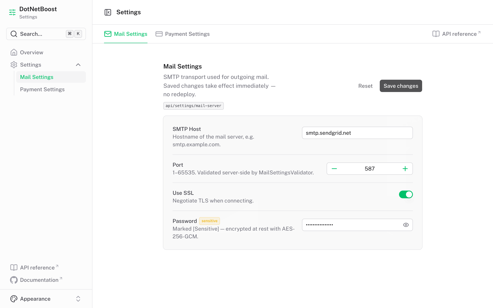
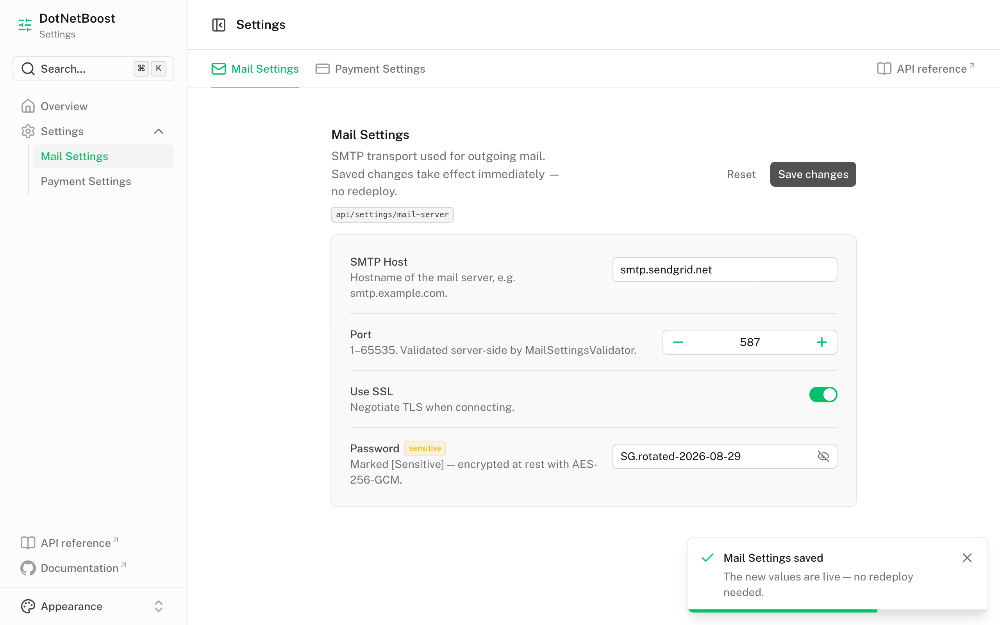
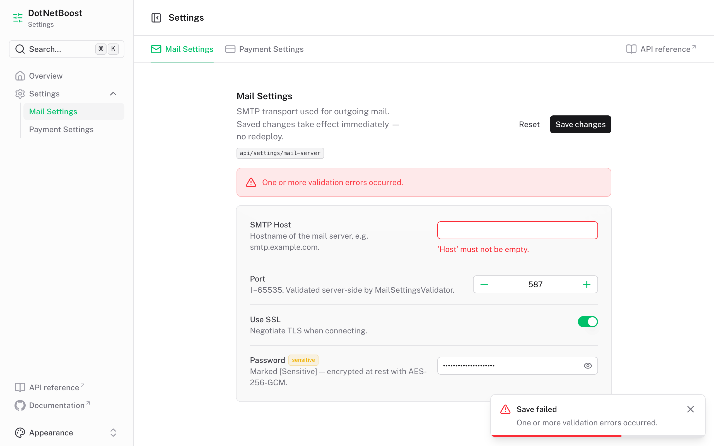

# Dashboard (SPA client)

[`clients/dashboard`](../clients/dashboard) is a [Nuxt 4](https://nuxt.com) single-page client for
those endpoints, built on the [Nuxt UI dashboard template](https://github.com/nuxt-ui-templates/dashboard).
A sidebar links to **Settings**, where a top menu holds one entry per settings group — each one
reads and writes its own group.

```bash
dotnet run --project samples/SampleApp --urls http://localhost:5199   # the API
npm install --prefix clients/dashboard && npm run dev --prefix clients/dashboard
```

The dashboard is at `http://localhost:3000`, the API reference at `http://localhost:5199/scalar`.
Or start both — plus PostgreSQL and Redis — with one `dotnet run`; see
[Running everything with .NET Aspire](aspire.md).

## One group, end to end

`MailSettings` from [`samples/SampleApp`](../samples/SampleApp) — the class, its `[Sensitive]`
property and its `MailSettingsValidator` — as the dashboard renders it:



The form is built from whatever `GET api/settings/mail-server` returned. `UseSsl` is a `bool`, so
it renders as a switch; `Password` is `[Sensitive]`, so it is masked behind a reveal toggle and the
value never touches the database unencrypted.



`Save changes` sends the whole group back with the `ETag` from the load as `If-Match`, so a save
that lost a race is refused rather than silently overwriting the other writer. The saved values are
live for the running application immediately.



Clear the host and the API rejects the write. Each `ValidationProblemDetails` message comes back
attached to the property it names — `RuleFor(x => x.Host).NotEmpty()` in `MailSettingsValidator`
lands under **SMTP Host**, with nothing written.

| File | Role |
|---|---|
| `app/utils/settings.ts` | Group registry — `route` must match `[SettingGroup("…")]` |
| `app/composables/useSettingsGroup.ts` | Load, dirty-tracking, save, server-error mapping |
| `app/components/settings/GroupForm.vue` | The form for one group |
| `app/pages/settings.vue` | Top menu, one entry per group |
| `server/api/settings/[...path].ts` | Nitro proxy to the .NET API |

Form fields are generated from whatever `GET` returns, so a property added to a C# settings class
shows up without touching the client — the registry only supplies labels and input constraints.
Booleans render as switches, `[Sensitive]` properties as masked inputs with a reveal toggle, and a
rejected `POST` has each `ValidationProblemDetails` message attached to the property it names.

The browser never calls the API directly: Nitro proxies `/api/settings/**` to
`NUXT_SETTINGS_API_URL`, so the API needs no CORS configuration. See
[`clients/dashboard/README.md`](../clients/dashboard/README.md) for the full setup.

